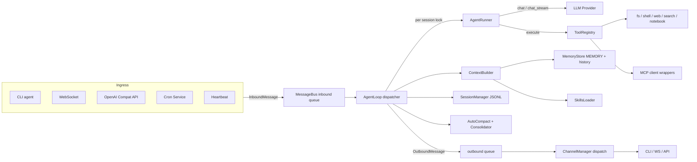

# nanobot 架构分析（Python → Go 移植基线）

本文是 Go 版重构的依据，来源于对上游 Python 版 `nanobot/nanobot/` 模块的逐文件分析，只保留移植 MVP 所需的事实。

---

## 1. 顶层架构



---

## 2. 单次用户输入的时序图

```mermaid
sequenceDiagram
    participant U as User
    participant Ch as Channel
    participant Bus as MessageBus
    participant Loop as AgentLoop
    participant Sess as SessionManager
    participant Ctx as ContextBuilder
    participant Run as AgentRunner
    participant P as Provider
    participant T as ToolRegistry
    U->>Ch: message
    Ch->>Bus: publish_inbound
    Loop->>Bus: consume_inbound
    Loop->>Sess: get_or_create session
    Loop->>Ctx: build_messages history + user
    Loop->>Run: run spec
    loop until final or max_iter
        Run->>P: chat_stream_with_retry
        P-->>Run: LLMResponse with tool_calls
        alt has tools
            Run->>T: execute concurrent
            T-->>Run: tool results
        else final text
            Run-->>Loop: final_content
        end
    end
    Loop->>Sess: append + save JSONL
    Loop->>Bus: publish_outbound
    Bus->>Ch: send or send_delta
    Ch->>U: reply
```

---

## 3. 核心算法

### 3.1 Agent Turn Loop（`agent/runner.py`）

每次 turn 最多执行 `max_tool_iterations` 轮，每轮伪代码：

```
for iter := 0; iter < max_iterations; iter++ {
    messages_for_model = repair_orphan_tool(messages)
    messages_for_model = microcompact(messages_for_model)
    messages_for_model = snip_history(messages_for_model, budget)

    hook.before_iteration(ctx)
    resp = provider.chat_stream_with_retry(messages_for_model, tools, ...)
        // 或 chat_with_retry（当 hook.wants_streaming() 为 false）

    if resp.should_execute_tools {
        hook.on_stream_end(resuming=true)
        messages += assistant_with_tool_calls(resp)
        checkpoint(phase="awaiting_tools")
        hook.before_execute_tools(ctx)
        results = execute_tools_concurrent(resp.tool_calls)
            // 按 tool.concurrency_safe 分组 gather
        messages += tool_results_messages(results)
        checkpoint(phase="tools_completed")
        messages = drain_injections(messages, max_per_turn=3)
        hook.after_iteration(ctx)
        continue
    }

    final = resp.content
    if empty(final) && empty_retries < 2 { continue }
    if finish_reason == "length" && length_recoveries < 3 { continue }
    messages += assistant_final(final)
    checkpoint(phase="final_response")
    hook.after_iteration(ctx)
    break
}
```

特殊路径约束：

- `_MAX_EMPTY_RETRIES = 2`
- `_MAX_LENGTH_RECOVERIES = 3`
- 中途 injection：每轮 drain 最多 `_MAX_INJECTIONS_PER_TURN = 3` 条，最多 `_MAX_INJECTION_CYCLES = 5` 轮

### 3.2 流式 Delta 处理（`agent/loop.py::_LoopHook.on_stream`）

```
prev_clean = strip_think(stream_buf)
stream_buf += delta
new_clean  = strip_think(stream_buf)
incremental = new_clean[len(prev_clean):]
if incremental != "" { on_stream(incremental) }
```

外发消息在 `metadata` 中携带：`_stream_delta: true`、`_stream_id: "<base>:<seg>"`、`_stream_end: true`、`_resuming: bool`。

### 3.3 AutoCompact（TTL 空闲压缩）

```
for each session in sessions:
    if key in active_session_keys: skip
    if now - session.updated_at > ttl:
        archive_session(key)        // background task
        cache _last_summary in session.metadata
```

归档时 `retain_recent_legal_suffix(8)` 保留最近 8 条合法尾部，之前的部分交给 `Consolidator.archive` 生成摘要，下次 `prepare_session` 时把摘要注入 runtime block 作为 `[Resumed Session]`。

### 3.4 Token 预算压缩（`Consolidator.maybe_consolidate_by_tokens`）

```
budget = context_window_tokens - max_completion_tokens - 1024
for round := 0; round < 5; round++ {
    estimate = estimate_prompt_tokens(messages, tools)
    if estimate < budget: break
    chunk = take_up_to_60_msgs_at_user_boundary(unconsolidated_tail)
    if len(chunk) == 0: break
    summary = consolidator.archive(chunk)     // LLM 总结
    memory.append_history(summary)
    session.last_consolidated += len(chunk)
}
```

### 3.5 Provider 重试

退避序列 `(1s, 2s, 4s)`，persistent 模式封顶 60s；`Retry-After` 头或结构化 `retry_after` 字段优先。

- 429：等待后重试
- 连接/超时类 `error_kind`：直接重试
- `finish_reason="error"` 且 `error_should_retry=true`：重试
- 非暂态错误且消息带图片：剥离图片重试一次

### 3.6 Dream 双阶段

```
// Phase 1
analysis = provider.chat(render("dream_phase1.md"), history_batch, tools=none)

// Phase 2
runner.run(AgentRunSpec{
    messages:  render("dream_phase2.md", skill_creator_path=...),
    tools:     [read_file, write_file, edit_file, list_dir],
    model:     dream.modelOverride || default,
    max_iterations: dream.maxIterations,
})

memory.advance_dream_cursor(...)
if git { git.auto_commit("dream: update memory") }
```

---

## 4. 关键数据契约

### 4.1 Bus 事件

- `InboundMessage{ Channel, SenderID, ChatID, Content, Timestamp, Media, Metadata, SessionKeyOverride? }`
  - `SessionKey() = SessionKeyOverride ?? Channel + ":" + ChatID`
- `OutboundMessage{ Channel, ChatID, Content, ReplyTo?, Media, Metadata }`

### 4.2 Provider

- `GenerationSettings{ Temperature=0.7, MaxTokens=4096, ReasoningEffort? }`
- `ToolCallRequest{ ID, Name, Arguments (map[string]any), ProviderSpecificFields? }`
- `LLMResponse{ Content, ToolCalls, FinishReason, Usage, RetryAfter?, ReasoningContent?, ThinkingBlocks?, ErrorStatusCode?, ErrorKind? }`
  - `ShouldExecuteTools = len(ToolCalls) > 0 && FinishReason ∈ {"tool_calls", "stop"}`
- 接口：`Chat`、`ChatStream(onDelta)`、`ChatWithRetry`、`ChatStreamWithRetry`、`GetDefaultModel`

### 4.3 Tool

```go
type Tool interface {
    Name() string
    Description() string
    Parameters() JSONSchema            // OpenAI function schema
    ReadOnly() bool
    ConcurrencySafe() bool
    Exclusive() bool
    Execute(ctx, args map[string]any) (string, error)
}
```

Registry 负责 `GetDefinitions()` 排序（内置工具在前、`mcp_*` 在后）、`PrepareCall`（解析/校验/报错）、`Execute`（执行 + 错误提示后缀）。

### 4.4 Session JSONL

第一行是 metadata：

```json
{"_kind":"metadata","key":"cli:default","created_at":"...","updated_at":"...","last_consolidated":0,"metadata":{...}}
```

后续每行一条 message：

```json
{"role":"user","content":"...","timestamp":"..."}
{"role":"assistant","content":"...","tool_calls":[...],"timestamp":"..."}
{"role":"tool","tool_call_id":"...","name":"...","content":"...","timestamp":"..."}
```

### 4.5 Memory

- `memory/MEMORY.md` — 长期记忆，Dream 更新
- `memory/history.jsonl` — 每行 `{cursor,timestamp,content}`
- `memory/.cursor` — 下一个可用 cursor（整数）
- `memory/.dream_cursor` — Dream 已处理到的 cursor
- 兼容：首次启动若 JSONL 为空而 `memory/HISTORY.md` 存在，迁移

---

## 5. 配置与目录约定

- 默认配置：`~/.nanobot/config.json`（可用 `--config` 覆盖）
- 默认 workspace：`~/.nanobot/workspace/`
- 环境变量注入：配置 JSON 中字符串里的 `${VAR}` 会展开；`NANOBOT_*__*` 覆盖对应字段（嵌套用 `__`，字段为 camelCase）
- 关键默认值：
  - `agents.defaults.model`、`provider`
  - `agents.defaults.maxTokens=4096`、`temperature=0.7`、`maxToolIterations=30`
  - `agents.defaults.contextWindowTokens=128000`、`contextBlockLimit=8000`、`maxToolResultChars=12000`
  - `agents.defaults.sessionTtlMinutes=0`（0 表示禁用 AutoCompact）
  - `api.host=127.0.0.1`、`api.port=8900`、`api.timeout=120`
  - `gateway.host=127.0.0.1`、`gateway.port=18790`
  - `gateway.heartbeat.enabled=true`、`intervalS=1800`、`keepRecentMessages=8`

---

## 6. Go 端模块映射

| Python | Go 包 |
| --- | --- |
| `agent/loop.py` | `internal/loop` |
| `agent/runner.py` | `internal/runner` |
| `agent/context.py` | `internal/context` |
| `agent/hook.py` | `internal/hook` |
| `agent/autocompact.py` | `internal/autocompact` |
| `agent/memory.py::MemoryStore` | `internal/memory` |
| `agent/memory.py::Consolidator` | `internal/consolidator` |
| `agent/memory.py::Dream` | `internal/dream` |
| `agent/skills.py` | `internal/skills` |
| `agent/subagent.py` | `internal/subagent` |
| `bus/` | `internal/bus` |
| `session/` | `internal/session` |
| `providers/base.py` | `internal/provider` |
| `providers/openai_compat_provider.py` | `internal/provider/openai` |
| `providers/anthropic_provider.py` | `internal/provider/anthropic` |
| `agent/tools/*.py` | `internal/tools/*` |
| `agent/tools/mcp.py` | `internal/mcp` + `internal/tools/mcpwrap` |
| `command/` | `internal/command` |
| `config/` | `internal/config` |
| `cli/commands.py` | `cmd/nanobot` |
| `cli/stream.py` | `cmd/nanobot` 内部 |
| `api/server.py` | `channels/api` |
| `channels/base.py` + `manager.py` | `channels/base` |
| `channels/websocket.py` | `channels/websocket` |
| `cron/` | `internal/cron` |
| `heartbeat/` | `internal/heartbeat` |
| `utils/gitstore.py` | `internal/gitstore` |
| `security/network.py` | `internal/security` |
| `utils/prompt_templates.py` + `templates/` | `internal/templates`（`embed`） |
| `skills/` | `skills/`（Go 原生包） |

---

## 7. 移植取舍清单

1. Python `asyncio.Queue` → Go `chan` + `context.Context`；避免"per-session asyncio.Lock"结构，改用 `sync.Mutex` 映射
2. Python `questionary` 交互向导在 MVP 里做成无交互最小 `onboard`，用户手写 `config.json`
3. Jinja2 模板只用到 `{{ var }}` 与简单 ``，改用 Go `text/template`
4. Tokenizer 用 `pkoukk/tiktoken-go`（cl100k_base），失败回退到 `char / 4`
5. OpenAI Responses API 仅在显式启用时使用，默认走 Chat Completions
6. Anthropic extended thinking 通过 `thinking_blocks` 传递；按 `ReasoningEffort ∈ {"","low","medium","high","adaptive"}` 映射 `budget_tokens`
7. Sandbox：Linux 下检测 `bwrap`，有则用；无则降级为 deny-list 正则
8. MsTeams/Feishu/Slack/Discord/QQ/Matrix/WhatsApp/Email/DingTalk/Telegram/WeChat/WeCom 均不做（保留 Channel 接口与目录）
9. Dream/Heartbeat/Cron/GitStore 在 P7 单独实现，早期阶段可用 no-op 占位
